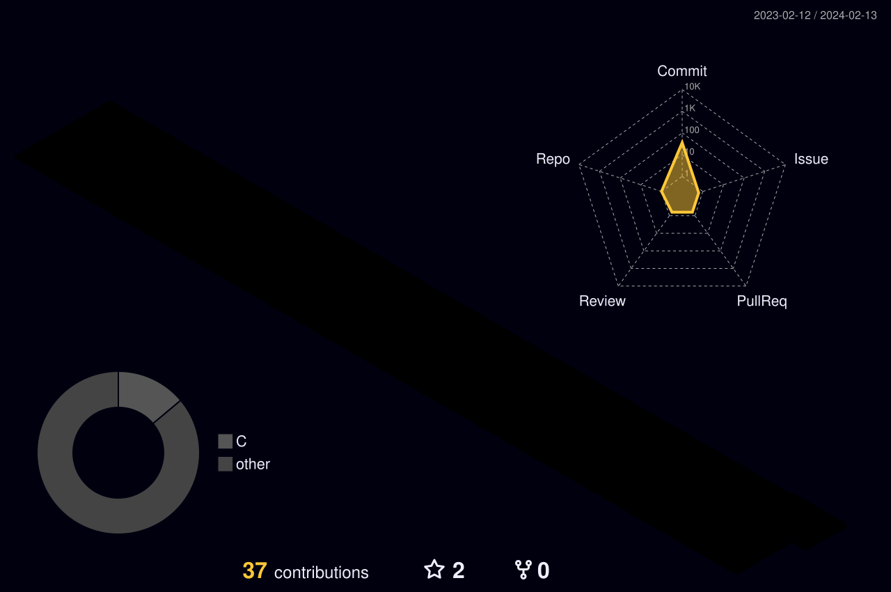

# Hi there, I'm **Sang Kyoung Park** 👋

**Aspiring Software Developer**

---

## 🧑‍💻 About Me

- 🎯 My goal is to become a professional **Software Developer**
- 🏋️ I enjoy **Fitness** and **Mountain Climbing**
- 📚 Continuously learning and growing every day

---

## ⚙️ Tech Stack

### 💻 Languages

### 🛠️ Tools & IDE

---

## 📊 GitHub Stats

---

## 🏆 3D Contribution Graph

