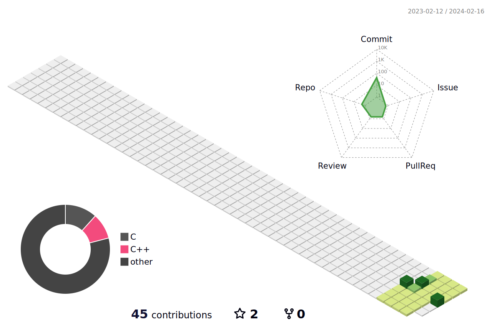

## 🤖 Profile
> 
 
 
 
	Name : Sang Koyung  Park
	Age : 1996.06.07
	Phone : 010 - 5670 - 3252
	Mail : tltmzh3@gmail.com
---
## 🙂 Introduce
 
	My dream is to become a  **Software Developer** 
	I enjoy Fitness, Mountain climbing!
	I hope I can improve my job qualification in the near future ⭐
---
## ⚙️ Skills

   
> 🛠️ IDE

     

> 🛠️ Programming Languages

        

> Running

